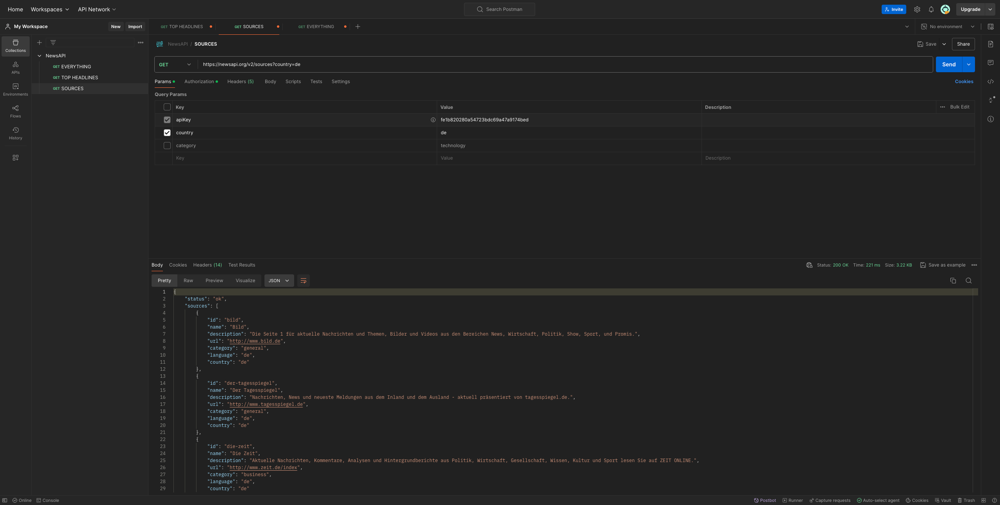
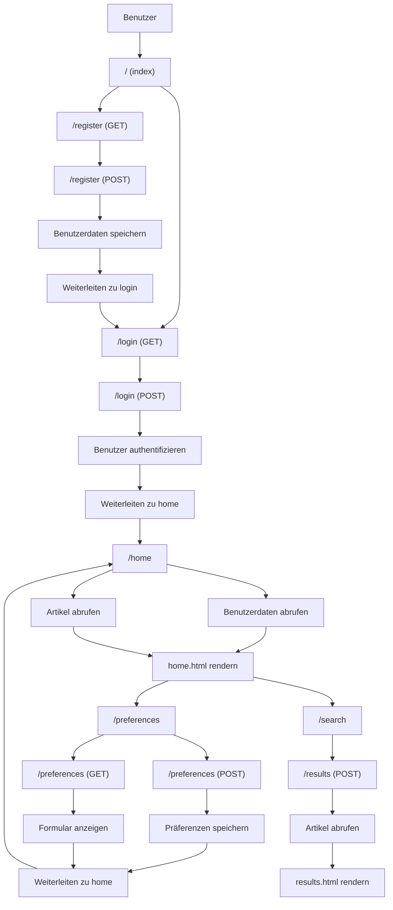

<a name="readme-top"></a>

[![MIT License][license-shield]][license-url]
[![LinkedIn][linkedin-shield]][linkedin-url]


<!-- PROJECT LOGO -->
<br />
<div align="center">
  <a href="https://github.com/lukasfasnacht/jarvis">
    
  </a>

  <h3 align="center">Semesterprojekt PRO2 FS24</h3>

  <p align="center">
    Dieses GitHub-Repository dient als Dokumentation für unser Semesterprojekt im Modul "Programmierung 2". In dieser README findet sich eine umfassende Beschreibung der Arbeit, einschliesslich Projektziele, verwendeter Technologien, Architektur, Funktionalitäten und Anwendungsfälle. Darüber hinaus bieten Anleitungen zur Installation und Nutzung des Informationssystems.
    <br />
    <a href="https://github.com/lukasfasnacht/jarvis/blob/main/README.md"><strong>Explore the docs »</strong></a>
    <br />
    <br />
    <a href="">View Website</a>
    ·
    <a href="https://github.com/lukasfasnacht/jarvis/issues/new">Report Bug</a>
    ·
    <a href="https://github.com/lukasfasnacht/jarvis/issues/new">Request Feature</a>
  </p>
</div>


<!-- Inhaltsverzeichnis  -->
<details>
  <summary>Inhaltsverzeichnis</summary>
  <ol>
    <li>
      <a href="#über-das-projekt">Über das Projekt</a>
    </li>
    <li>
      <a href="#idee-und-problemstellung">Idee und Problemstellung</a>
    </li>
    <li>
      <a href="#lösung">Lösung</a>
    </li>
      <ol>
        <li>
          <a href="#api">API</a>
        </li>
        <li>
          <a href="#api-einbindung-flask">API Einbindung FLASK</a>
        </li>
        <li>
          <a href="#benutzeransichten">Benutzeransichten</a>
        </li>
        <li>
          <a href="#user-input">User Input</a>
        </li>
        <li>
          <a href="#user-flow-diagram">User Flow Diagram</a>
        </li>
        <li>
          <a href="#datenverarbeitung">Datenverarbeitung</a>
        </li>
        <li>
          <a href="#session-verwaltung">Session Verwaltung/a>
        </li>
        <li>
          <a href="#api-daten">API Daten</a>
        </li>
      </ol>
    <li>
      <a href="#getting-started">Getting Started</a>
    </li>
      <ol>
        <li>
          <a href="#voraussetzungen">Voraussetzungen</a>
        </li>
        <li>
          <a href="#installation">Installation</a>
        </li>
      </ol>
    <li>
      <a href="#bekannte-bugs">Bekannte Bugs</a>
    </li>
    <li>
      <a href="#ressourcen">Ressourcen</a>
    </li>
    <li>
      <a href="#lizenz">Lizenz</a>
    </li>
    <li>
      <a href="#kontakt">Kontakt</a>
    </li>
  </ol>
</details>


## Über das Projekt

Im Rahmen des Moduls "Programmierung 2" wurde die Aufgabe erlegt eine Webappliktion mithilfe des Microframeeworks Flask zu entwickeln. Wie diese Aufgabe umgesetzt wird, war uns, den Studierenden, überlassen. Während des Projektes gab es die Möglichkeiten Webex Meetings, mit unserem Dozent Ingmar Baetge, aufzusetzen.

<p align="right">(<a href="#readme-top">back to top</a>)</p>

## Idee und Problemstellung

Um dem Erfolg des ersten Flask Projekts im Rahmen der Lehrveranstaltung Grundlagen Informationssysteme gerecht zu werden und die neu erlernten Skills in der Datenerhebung anzuwenden war die Überlegung neu noch mit einer API zu arbeiten. Die Idee war es mithilfe der [NewsAPI](https://newsapi.org/) eine WebApplikation zu erstellen, welche dem User ermöglicht anhand verschiedener Kriterien (Thema, Land, Keyword) die neusten Nachrichten darzustellen. Ganz nach dem Motto "Personalize everything" soll jeder User die Möglichkeit haben sich ein eigenes Nachrichten Profil anzulegen und sich mittels Einstellung ein massgeschneidertes News Dashboard zu gestalten. 

<p align="right">(<a href="#readme-top">back to top</a>)</p>

## Lösung

Die Idee wurde wie folgt umgesetzt:

### API

Das ganze Projekt steht und fällt mit der API [NewsAPI](https://newsapi.org/). Die API vefügt über dein Developer Pricing Model, welches kostenlos verfügbar ist. Die Developer Version ist auf 100 Requests pro Tag begrenzt, was für diese Projekt allerdings erstmals ausreicht. Die API verfügt über grundsätzlich 3 verschiedene API Abfragemöglichkeiten: EVERYTHING, TOP HEADLINES und SOURCES.
* EVERYTHING: Mittels dem Endpoint EVERYTHING und den Keys "domains" oder "q" kann man alle Newsartikel von einer gewissen Quelle (domains) oder zu einem bestimmten Keyword (q) suchen.
* TOP HEADLINES: Ähnlich wie der Endpoint Domain kann man mittels TOP HEADLINES und den Keys "country", "category" und "q" die Schlagzeilen zu einem bestimmten Keyword (q), aus einer Kategorie (category) oder zu einem spezifischem Land (country) suchen.
* SOURCES: Anders wie die restlichen Endpoints kann man mittels SOURCES und den Keys "country" und "category" Nachrichtenanbieter aus einem spezifischen Land (country) oder zu einem spezifischem Thema (category) suchen.

Mehr zu den einzelnen Endpoints in der [NewsAPI Dokumentation](https://newsapi.org/docs/endpoints).

In diesem Projekt wird der Endpoint TOP HEADLINES für die Suche mittels "category" und "country" und der Endpoint EVERYTHING für die Suche mittels "q" verwendet. Die Evaluation für die richtigen Endpoints wurde mittels [Postman](https://www.postman.com/) durchgeführt. Postman ist ein API-Entwicklungstool, das Entwicklern ermöglicht, APIs zu testen, zu debuggen, zu dokumentieren und zu simulieren. Postman ist etwas überdimensionert für solch ein kleiner Test, das Tool wurde trotzdem ausgewählt um einmal die ersten Erfahrungen damit zu sammeln.



### API Einbindung FLASK

Für die Einbindung der API in Python, genauer genommen in das Flask Modul, gibt es wahrscheinlich etliche Möglichkeiten. Wir konzentrieren uns hier jedoch nur auf 2.
* newsapi-python: Es gibt ein inoffizielles Python Modul Namens [newsapi-python](https://github.com/mattlisiv/newsapi-python), welches Abfragen über die 3 Endpoints der API ermöglicht und die Ergebnisse im JSON-Format liefert. Diese können dann leicht in Dictionaries und Listen konvertiert und weiterverarbeitet werden. 
* Requests: Das Requests-Modul ermöglicht HTTP-Anfragen durchzuführen und somit auch HTTP-Methoden GET, POST, PUT und DELETE. Ermöglicht somit auch API Abfragen, welche die Ergebnisse ebenfalls im JSON-Format liefert.

Die einfachere und kürzere Methode wäre die API Abfragen mittels dem newsapi-python Moduls durchzuführen. Dies hat Anfangs auch ohne Probleme funktioniert. Leider tauchte Anfangs Mai ein Bug auf, bei dem die Abfrage über den Endpoint TOP HEADLINES und dem key "country" nur Ergebnisse zum Ländercode der USA geliefert hat. Aufgrund dieses Issues mussten die Abfragen neu über das Modul Requests laufen. Mehr zum [Bug](https://github.com/mattlisiv/newsapi-python/issues/93).

### Benutzeransichten

#### 1. Index (`/`)
Die Startseite der Anwendung, User kann sich entweder Anmelden oder Registrieren.

#### 2. Registrierung (`/register`)
- **GET**: Zeigt das Registrierungsformular an, in dem der Benutzer seine E-Mail und sein Passwort eingeben kann.
- **POST**: Verarbeitet die Registrierung, speichert die Benutzerdaten und leitet den Benutzer zur Login-Seite weiter.

#### 3. Login (`/login`)
- **GET**: Zeigt das Login-Formular an, in dem der Benutzer seine E-Mail und sein Passwort eingeben kann.
- **POST**: Verarbeitet die Login-Anfrage, authentifiziert den Benutzer und leitet ihn zur Startseite weiter.

#### 4. Logout (`/logout`)
Meldet den Benutzer ab und leitet ihn zur Index-Seite zurück.

#### 5. Home (`/home`)
Diese Seite wird angezeigt, nachdem der Benutzer erfolgreich eingeloggt wurde. Sie zeigt personalisierte Nachrichtenartikel basierend auf den Präferenzen des Benutzers an.

#### 6. Präferenzen (`/preferences`)
- **GET**: Zeigt ein Formular an, in dem der Benutzer seine Nachrichtenpräferenzen (Land, Kategorie, Schlüsselwort) eingeben kann.
- **POST**: Verarbeitet die Präferenzeinstellungen und speichert sie, anschliessend wird der Benutzer zur Home-Seite weitergeleitet.

#### 7. Suche (`/search`)
Zeigt ein Formular an, in dem der Benutzer nach Nachrichtenartikeln suchen kann, indem er Kriterien wie Land, Kategorie oder Schlüsselwort eingibt.

#### 8. Ergebnisse (`/results`)
- **POST**: Verarbeitet die Suchanfrage, ruft die entsprechenden Nachrichtenartikel von der News API ab und zeigt die Ergebnisse an.

### User Input
#### Benutzerregistrierung und -anmeldung:
Benutzer können sich registrieren, indem sie eine E-Mail und ein Passwort angeben. Das Passwort wird sicher gehasht und zusammen mit den Benutzerinformationen in einer JSON-Datei gespeichert.
Beim Anmelden wird das eingegebene Passwort mit dem gespeicherten Hash verglichen. Bei erfolgreicher Authentifizierung wird der Benutzer angemeldet und zur Startseite weitergeleitet.

#### Benutzerdashboard:
Angemeldete Benutzer können ihre Präferenzen für Nachrichten festlegen (Land, Kategorie, Stichwort). Diese Präferenzen werden in der entsprechenden JSON-Datei des Benutzers gespeichert.

#### Nachrichtensuche:
Benutzer können Nachrichten basierend auf ihren Präferenzen durchsuchen und anzeigen lassen. Die Anwendung verwendet die NewsAPI, um relevante Nachrichtenartikel abzurufen.

### User Flow Diagram



#### Wichtige Punkte:
1. **Index (`/`)**: Rendert die Index-Seite.
2. **Registrierung (`/register`)**:
   - `GET`: Zeigt das Registrierungsformular.
   - `POST`: Speichert Benutzerdaten und leitet zu Login weiter.
3. **Login (`/login`)**:
   - `GET`: Zeigt das Login-Formular.
   - `POST`: Authentifiziert den Benutzer und leitet zu Home weiter.
4. **Logout (`/logout`)**: Meldet den Benutzer ab und leitet zur Index-Seite weiter.
5. **Home (`/home`)**: Ruft Benutzerdaten und Artikel ab und rendert die Startseite.
6. **Präferenzen (`/preferences`)**:
   - `GET`: Zeigt das Präferenzformular.
   - `POST`: Speichert Präferenzen und leitet zu Home weiter.
7. **Suche (`/search`)**: Zeigt das Suchformular.
8. **Ergebnisse (`/results`)**: Ruft Artikel basierend auf Suchkriterien ab und rendert die Ergebnisse.

#### Hilfsfunktion:
- **Artikel abrufen (`fetch_articles`)**: Ruft Artikel von der News API ab.

### Datenverarbeitung
#### Benutzer Daten:
Die Benutzer Daten werden in einem JSON File gepspeichert. Für dieses Projekt wurde auf JSON Files anstatt auf eine Datenbank, wie SQLite, gesetzt aus dem Grund das JSON ein wahnsinnig flexibles Dateiformat ist, bei welchem man leicht neue Datenfelder hinzufügen kann ohne die gesamte Datenstruktur anzupassen.
```json
{
    "email": "user@example.com",
    "password": "hashed_password",
    "dashboard": {
        "country": "",
        "category": "",
        "keyword": ""
    }
}
```

### Session Verwaltung:
Flask verwendet ein Cookie-basiertes Session-Management. Die Sitzungsdaten werden auf dem Client-Seite in einem signierten Cookie gespeichert, das eine sichere Methode zur Speicherung von Daten ist. Der **secret_key** wird dabei verwendet den Cookie zu signieren, damit diese nicht manipuliert werden kann. Der **secret_key** wir in diesem fall auch ausgelagert und mittels **import** als Variable eingefügt. Wenn sich der Benutzer einloggt, wird die Session mittels der E-Mail des Benutzers initialisiert 
```python
@app.route('/login', methods=['GET', 'POST'])
def login():
    if request.method == 'POST':
        [...]
            if check_password_hash(user_data['password'], password):
                session['user'] = email
                return redirect(url_for('home'))
        [...]
```
und bei einem Logout wieder gelöscht
```python
@app.route('/logout')
def logout():
    session.pop('user', None)
    return redirect(url_for('index'))
```
Bei Seiten welche man ohne Login nicht einsehen darf wird gecheckt, ob sich der User in einer Session befindet. Falls nicht wird man auf die Login Seite zurückgeleitet
```python
[...]
if 'user' not in session:
  return redirect(url_for('login'))
[...]
```

### API Daten:
Die Nachrichtenartikel, welche bei einer Anfrage über einer der Endpoints übergeben werden, beinhalten die Informationen über Nachrichtenquelle, Author, Titel, Beschreibung, URL zum Artikel, Bild, Publikationsdatum und die ersten paar Zeilen des Artikels. Wir verwenden dabei den Titel, Beschreibung, Bild und die URL zum Artikel. Wichtig dabei zu erwähnen ist das es nicht zu jedem Artikel ein Bild und eine Beschreibung gibt, weshalb Platzhalter eingesetzt werden. 

Beispiel eines Nachrichtenartikel, welcher als JSON übermittelt wird:
```json
{
            "source": {
                "id": "bloomberg",
                "name": "Bloomberg"
            },
            "author": "Matthew Martin, Julia Fioretti",
            "title": "Saudis Said to Hand About 60% of Aramco Offer to Foreign Funds - Bloomberg",
            "description": "Foreign investors are set to be allocated about 60% of the shares on offer in Saudi Aramco’s $11.2 billion stock sale, people familiar with the matter said, marking a turnaround from the oil giant’s 2019 listing that ended up as a largely local affair.",
            "url": "https://www.bloomberg.com/news/articles/2024-06-08/saudis-said-to-hand-about-60-of-aramco-offer-to-foreign-funds",
            "urlToImage": "https://assets.bwbx.io/images/users/iqjWHBFdfxIU/iJtGT7mWJI_Q/v0/1200x800.jpg",
            "publishedAt": "2024-06-08T13:04:37Z",
            "content": "Foreign investors are set to be allocated about 60% of the shares on offer in Saudi Aramcos $11.2 billion stock sale, people familiar with the matter said, marking a turnaround from the oil giants 20… [+332 chars]"
        }
```

<p align="right">(<a href="#readme-top">back to top</a>)</p>

## Getting Started

In den nächsten zwei Kapitel wird erklärt wie man die Webapplikation bei sich selbst lokal laufen lassen kann.

### Voraussetzungen

Folgende Software und Bibliotheken sind notwendig für das Betreiben der Webapplikation:
* Python: <br>
  Über die [Python-Homepage](https://www.python.org/downloads/)<br>
  Homebrew:
    ```sh
    brew install python
    ```
* Python Module
  ```sh
  pip3 install -r requirements.txt
  ```

### Installation

1. Klone dieses Repo
   ```sh
   git clone https://github.com/lukasfasnacht/GLIN
   ```
2. config.py erstellen mit dem Inhalt
   ```sh
   secret_key='Hier zufällige Zeichenfolge einfügen'
   newsapi_key = 'Hier API Key einfügen'
   ```

3. Starte die Webapplikation
   ```sh
   python3 app.py
   ```
4. Öffne http://127.0.0.1:5000/ in deinem Browser

5. Registriere den ersten Account

6. Melde dich mit dem Account an

7. Suche über die Funktion "Artikel suchen" nach Artikeln oder konfiguriere über Dashboard Settings dein ganz persönliches News-Dashboard

<p align="right">(<a href="#readme-top">back to top</a>)</p>

## Bekannte Bugs

### Artikel suchen
Wenn man beim Formular Artikel suchen, keine Angaben macht und das Formular leer abschickt, meldet der Flask-Server eine Fehlermeldung, da in der funktion def_results gecheckt wird ob Artikel übergeben werden und wenn nicht eine Fehlermeldung kommt. 

<p align="right">(<a href="#readme-top">back to top</a>)</p>

## Ressourcen

Folgende Ressourcen dienten zur Unterstützung dieses Projektes

* Ingmar Beatge und die Vorlesungsunterlagen zu PRO2
* [NewsAPI-Dokumentation](https://newsapi.org/docs)
* [Stackoverflow](https://stackoverflow.com/)
* [Github-Copilot](https://github.com/features/copilot)
* [Flask-Dokumentation](https://flask.palletsprojects.com/en/3.0.x/)
* [Tailwind-Dokumentation](https://v2.tailwindcss.com/docs)
* [Tailwind-Tutorial](https://www.youtube.com/watch?v=pfaSUYaSgRo)


<p align="right">(<a href="#readme-top">back to top</a>)</p>


## Lizenz

Vertrieben unter der MIT-Lizenz. Weitere Informationen finden Sie in `LICENSE.txt`.


<p align="right">(<a href="#readme-top">back to top</a>)</p>


## Kontakt

Lukas Fasnacht  - lukas.fasnacht@gmail.com

Projekt Link: [https://github.com/lukasfasnacht/GLIN](https://github.com/lukasfasnacht/GLIN)

<p align="right">(<a href="#readme-top">back to top</a>)</p>


<!-- Links  und Bilder -->
[license-shield]: https://img.shields.io/github/license/lukasfasnacht/GLIN.svg?style=for-the-badge
[license-url]: https://github.com/lukasfasnacht/jarvis/blob/main/LICENSE.txt
[linkedin-shield]: https://img.shields.io/badge/-LinkedIn-black.svg?style=for-the-badge&logo=linkedin&colorB=555
[linkedin-url]: https://www.linkedin.com/in/lukas-fasnacht-593a67156/